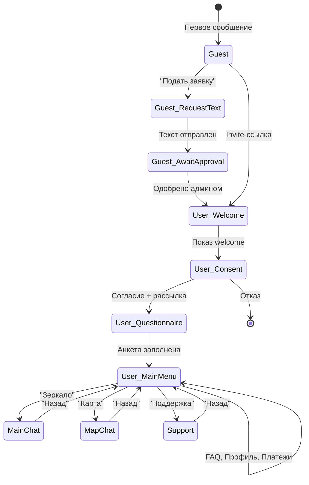

# ТЕХНИЧЕСКИЙ HANDOFF — ai-vk-rest-api

> Дата: 2026-08-19  
> Разработчик: Виталий (@vitaly06)
> Репозиторий: https://github.com/vitaly06/ai-vk-rest-api

---

## 1. АКТУАЛЬНОЕ СОСТОЯНИЕ КОДА

### Ветка и коммит
- **Ветка:** `master` (единственная)
- **Последний коммит:** `c5d3c40` — `fix: add JSON to ai response`
- **Всего коммитов:** 22
- **Теги:** отсутствуют

### Локальные изменения
- Локальных изменений **нет** — рабочая директория чистая (`git status` → «нечего коммитить»).
- Git stash — пуст.
- Всё синхронизировано с `origin/master`.

### Другие ветки / приватные репозитории
- Других веток **нет** (только `master`).
- Приватных репозиториев, связанных с проектом, **нет**.
- Весь код содержится в одном репозитории.

### Файлы вне репозитория (.gitignore)
`.gitignore` содержит всего 2 записи:
```
.env
/tmp
```

**Что НЕ попадает в репозиторий, но нужно для работы:**
| Файл | Описание |
|------|----------|
| `.env` | Рабочая конфигурация со всеми секретами (см. раздел 3) |
| `/tmp` | Временные файлы hot-reload (Air) |
| `bot.exe` | Скомпилированный бинарник (13 МБ, для Windows) — артефакт, не нужен |
| `*.bak`, `*.pre_linefix` | Бэкапы файлов handlers — лежат в handlers/, попали в git, но не используются |

> **ВАЖНО:** Файлы `admin.go.bak` и `admin.go.pre_linefix` в `internal/bot/handlers/`, а также `keyboards.go.pre_linefix` в `keyboards/` — это бэкап-копии. Они **не влияют** на сборку, но засоряют репозиторий. Можно безопасно удалить.

---

## 2. ТОЧНОЕ РАЗВЁРТЫВАНИЕ

### Способ запуска

Проект **развёрнут на production-сервере** через Docker Compose.  
Во время разработки использовался `air` (hot-reload для Go) локально.

### Production-сервер
- **IP:** `5.35.88.205`
- **Порт:** `8080`
- **Хостинг:** [Beget](https://beget.com/) (VPS)
- **Запуск:** `docker compose up -d --build`
- **Директория проекта на сервере:** уточнить у разработчика (Виталия) или найти через `find / -name docker-compose.yml 2>/dev/null`

### Полный порядок запуска с чистой машины

#### Вариант A: Полностью локально (для разработки)

```bash
# 1. Установить Go >= 1.25
# 2. Установить PostgreSQL 16 и Redis 7
# 3. Создать базу данных
createdb VkBot

# 4. Клонировать репозиторий
git clone https://github.com/vitaly06/ai-vk-rest-api.git
cd ai-vk-rest-api

# 5. Скопировать и заполнить .env
cp .env.example .env
# Отредактировать .env — заполнить все секреты (см. раздел 3)

# 6. Установить зависимости
go mod download

# 7. Запустить
go run ./cmd/bot
# или с hot-reload:
# go install github.com/air-verse/air@latest
# air
```

#### Вариант B: Docker Compose (подготовлен, но не тестировался полностью)

```bash
# 1. Установить Docker и Docker Compose
# 2. Клонировать и настроить .env
git clone https://github.com/vitaly06/ai-vk-rest-api.git
cd ai-vk-rest-api
cp .env.example .env
# Отредактировать .env

# 3. ВАЖНО: В .env заменить DB_HOST=localhost на DB_HOST=postgres
#    и REDIS_ADDR=localhost:6379 на REDIS_ADDR=redis:6379

# 4. Запустить
docker compose up -d --build
```

> **⚠️ ВНИМАНИЕ:** В `docker-compose.yml` порт бота указан как `8080:8080`, но в `.env` — `SERVER_PORT=3000`. Это несоответствие. В режиме Long Poll порт сервера **не используется** (нет HTTP-сервера), поэтому маппинг портов не критичен. Если переключитесь на Callback API — нужно синхронизировать.

> **⚠️ ВНИМАНИЕ:** В `docker-compose.yml` база называется `ai_vk_bot`, а в `.env` — `VkBot`. Нужно привести к единому виду.

> **⚠️ ВНИМАНИЕ:** Dockerfile указывает `golang:1.25-alpine`. Если такой образ недоступен на Docker Hub, замените на актуальную версию Go.

### Версии окружения
| Компонент | Версия |
|-----------|--------|
| Go | 1.25.4 (указано в go.mod) |
| PostgreSQL | 16 (Alpine, в docker-compose) |
| Redis | 7 (Alpine, в docker-compose) |
| VK SDK | github.com/SevereCloud/vksdk/v3 v3.3.0 |

### Команды build/start/stop/restart

```bash
# Сборка
go build -o bot ./cmd/bot

# Запуск
./bot

# Запуск с hot-reload (разработка)
air

# Docker
docker compose up -d --build    # start
docker compose down              # stop
docker compose restart bot       # restart
docker compose logs -f bot       # логи
```

### Логи
- Бот пишет логи в **stdout** в формате JSON (slog.JSONHandler).
- **На сервере:** `docker compose logs -f bot`
- При локальном запуске — прямо в терминал.
- Air сохраняет ошибки сборки в `build-errors.log`.

### Проверка, что всё работает
1. В логах появится: `"msg":"starting bot","group_id":236857878,"mode":"longpoll"`
2. Затем: `"msg":"bot started","mode":"longpoll"`
3. Напишите боту в VK — он должен ответить.

> ✅ **Подтверждено:** На момент handoff бот работает на `5.35.88.205`, AI-ответы приходят, всё реализованное функционирует.

---

## 3. ФАКТИЧЕСКИЙ РАБОЧИЙ .env

### Все переменные и их назначение

| Переменная | Обязательна | Значение в рабочей версии | Описание |
|------------|:-----------:|---------------------------|----------|
| **VK_TOKEN** | ✅ | `vk1.a.diIPK...` | Токен группы VK (см. секреты ниже) |
| **VK_GROUP_ID** | ✅ | `236857878` | ID группы ВКонтакте |
| **VK_CONFIRMATION_TOKEN** | ❌ | `your_confirmation_token_here` | Для Callback API — **не используется** при Long Poll |
| **VK_SECRET** | ❌ | `your_callback_secret_here` | Для Callback API — **не используется** при Long Poll |
| **ADMIN_IDS** | ✅ | `0` (фактически: `383591420` закомментирован) | VK User IDs администраторов, через запятую |
| **DB_HOST** | ✅ | `localhost` | Хост PostgreSQL |
| **DB_PORT** | ✅ | `5432` | Порт PostgreSQL |
| **DB_USER** | ✅ | `postgres` | Пользователь БД |
| **DB_PASSWORD** | ✅ | `postgres` | Пароль БД |
| **DB_NAME** | ✅ | `VkBot` | Название базы данных |
| **DB_SSLMODE** | ✅ | `disable` | SSL-режим подключения |
| **REDIS_ADDR** | ✅ | `localhost:6379` | Адрес Redis |
| **REDIS_PASSWORD** | ❌ | _(пусто)_ | Пароль Redis (не задан) |
| **REDIS_DB** | ❌ | `0` | Номер БД Redis |
| **AI_PROVIDER** | ✅ | `yandex` | Провайдер AI: `openai` / `yandex` / `custom` |
| **AI_BASE_URL** | ❌ | `https://ai.api.cloud.yandex.net/v1` | Базовый URL API (автоопределяется по провайдеру) |
| **AI_API_KEY** | ❌* | _(пусто в .env)_ | API-ключ AI. Подхватывается из YANDEX_API_KEY |
| **YANDEX_API_KEY** | ✅** | `AQVNyiz9pOi...` (IAM/API-ключ Яндекса) | API-ключ для YandexGPT |
| **YANDEX_FOLDER_ID** | ✅** | `b1gk0u23tfejbe5pb3jh` | ID каталога Yandex Cloud |
| **AI_MODEL** | ❌ | `yandexgpt-lite/latest` | Модель AI |
| **AI_MAX_TOKENS** | ❌ | `2048` | Макс. токенов в ответе |
| **AI_SYSTEM_PROMPT_FILE** | ❌ | `system_prompt.txt` | Путь к файлу системного промпта |
| **AI_SYSTEM_PROMPT** | ❌ | _(не задан)_ | Промпт текстом (приоритет у файла) |
| **AI_DEBUG_PAYLOAD** | ❌ | `true` | Логировать запросы/ответы AI |
| **YOOKASSA_SHOP_ID** | ❌ | _(пусто)_ | ID магазина YooKassa |
| **YOOKASSA_SECRET_KEY** | ❌ | _(пусто)_ | Секретный ключ YooKassa |
| **PAYMENT_RETURN_URL** | ❌ | `https://vk.me/your_community` | URL возврата после оплаты |
| **SERVER_PORT** | ❌ | `3000` | Порт HTTP-сервера (для Callback API) |
| **SERVER_HOST** | ❌ | `0.0.0.0` | Хост HTTP-сервера |
| **INVITE_LINK_TTL_HOURS** | ❌ | `72` | Время жизни ссылки-приглашения (часы) |
| **BOT_MODE** | ❌ | `longpoll` | Режим: `longpoll` / `callback` |

_\* AI_API_KEY может быть пустым если задан YANDEX_API_KEY (fallback в config.go)_
_\** Обязательны при AI_PROVIDER=yandex_

### Переменные из .env.example, которые устарели
- **AI_SYSTEM_PROMPT** — в рабочей версии используется **AI_SYSTEM_PROMPT_FILE** вместо inline-промпта.

### Секреты — где их получить/перевыпустить

| Секрет | Сервис | Где создать |
|--------|--------|-------------|
| **VK_TOKEN** | ВКонтакте | Настройки группы → Работа с API → Ключи доступа. Нужен токен группы с правами на сообщения |
| **YANDEX_API_KEY** | Yandex Cloud | [console.yandex.cloud](https://console.yandex.cloud/) → Сервисные аккаунты → API-ключи. Либо IAM-токен |
| **YANDEX_FOLDER_ID** | Yandex Cloud | [console.yandex.cloud](https://console.yandex.cloud/) → ID каталога (folder) |
| **DB_PASSWORD** | PostgreSQL | Локальная настройка при установке PostgreSQL |
| **REDIS_PASSWORD** | Redis | Локальная настройка (сейчас без пароля) |
| **YOOKASSA_SHOP_ID** | YooKassa | [yookassa.ru](https://yookassa.ru/) → Личный кабинет → Настройки магазина |
| **YOOKASSA_SECRET_KEY** | YooKassa | Там же, в разделе API-ключей |

---

## 4. СЕРВЕР И ИНФРАСТРУКТУРА

### Текущее развёртывание

Проект **развёрнут и работает** на VPS.

| Параметр | Значение |
|----------|----------|
| **IP** | `5.35.88.205` |
| **Порт** | `8080` |
| **Хостинг** | [Beget](https://beget.com/) — VPS |
| **Способ запуска** | Docker Compose |
| **Режим бота** | Long Poll (не требует внешнего доступа к порту) |

### Что нужно для получения доступа к серверу
- SSH-доступ к `5.35.88.205` — запросить у разработчика (Виталия) или восстановить через панель Beget
- Аккаунт Beget — уточнить, на чей аккаунт зарегистрирован VPS

### Сервисы на сервере (Docker Compose)
- **bot** — приложение Go (бот)
- **postgres** — PostgreSQL 16 Alpine
- **redis** — Redis 7 Alpine

### Docker volumes
- `postgres_data` — данные PostgreSQL
- `redis_data` — данные Redis

### Что НЕ настроено
- Нет reverse proxy (nginx/Caddy) — не нужен для Long Poll
- Нет домена и DNS
- Нет SSL-сертификатов
- Нет systemd-юнитов (используется Docker restart: unless-stopped)
- Нет cron-задач
- Нет бэкапов БД

### Автозапуск после reboot
- Docker-контейнеры имеют `restart: unless-stopped` — перезапустятся автоматически если Docker daemon запущен
- Если Docker не стартует автоматически: `sudo systemctl enable docker`

---

## 5. БАЗА ДАННЫХ

### СУБД и подключение
- **СУБД:** PostgreSQL 16
- **Название базы:** `VkBot` (в .env) / `ai_vk_bot` (в docker-compose) — **нужно привести к единому виду!**
- **Пользователь:** `postgres`
- **Пароль:** `postgres`
- **Подключение:** `host=localhost port=5432 user=postgres password=postgres dbname=VkBot sslmode=disable`

### Миграции
- Единственная миграция: `migrations/001_init.sql`
- Применяется **автоматически** при каждом старте приложения (в `main.go`)
- Использует `CREATE TABLE IF NOT EXISTS` — безопасно для повторного применения
- Дополнительно в `main.go` есть inline ALTER для добавления `'support'` в enum типа диалога

### Таблицы в базе

| Таблица | Назначение |
|---------|-----------|
| `users` | Пользователи (VK ID, роль, статус, баланс, лимиты) |
| `dialogs` | Ветви диалогов (main/map/support) |
| `messages` | История сообщений в диалогах |
| `invites` | Ссылки-приглашения |
| `access_requests` | Заявки на вступление |
| `questionnaire_answers` | Ответы анкеты |
| `payments` | Платежи |
| `products` | Товары/услуги |
| `bot_settings` | Настройки бота (key-value) |
| `audit_logs` | Журнал действий администраторов |

### Данные
- Если бот запускался для тестирования — в базе могут быть тестовые данные.
- Реальных пользовательских данных, которые необходимо сохранить, **нет** (проект в стадии разработки).
- Дамп БД **не нужен** — миграция создаст всё с нуля.
- Резервное копирование **не настроено**.

---

## 6. VK

### Группа
- **Group ID:** `236857878`
- **URL:** [https://vk.ru/club236857878](https://vk.ru/club236857878)
- **Владелец группы:** Виталий (разработчик)

### Режим работы
- Используется **Long Poll** (`BOT_MODE=longpoll`)
- Callback API **подготовлен** в коде (конфиг есть), но **не использовался**.

### Настройки группы VK (нужно сделать в кабинете)
1. **Работа с API** → Создать ключ доступа (токен) с правами:
   - Сообщения сообщества
   - Управление сообществом (для Long Poll)
2. **Сообщения** → Включить сообщения сообщества
3. **Long Poll API** → Включить Long Poll API
4. **Типы событий** → Включить:
   - `message_new` (новое сообщение) — **единственное используемое событие**
5. **Если планируется Callback API:**
   - Настроить URL сервера
   - Указать строку подтверждения (VK_CONFIRMATION_TOKEN)
   - Секретный ключ (VK_SECRET)

### Права токена
- `messages` — отправка/получение сообщений

### Admin/Moderator VK IDs
- В `.env.example`: `ADMIN_IDS=383591420`
- В рабочей `.env`: `ADMIN_IDS=0` (фактически — без админов)
- Закомментирован: `# ADMIN_IDS=383591420`

### Deep Links (приглашения)
Ссылки-приглашения формируются как: `https://vk.me/club236857878?ref=<uuid-token>`

---

## 7. ИИ

### Провайдер и модель
- **Провайдер:** YandexGPT (`AI_PROVIDER=yandex`)
- **Модель:** `yandexgpt-lite/latest`
- **API URL:** `https://ai.api.cloud.yandex.net/v1/chat/completions`

### System prompts
Три файла промптов в корне проекта:

| Файл | Режим | Строк | Описание |
|------|-------|-------|----------|
| `system_prompt.txt` | Fallback/базовый | 49 | «Армиллярная сфера» — экзистенциальный текстовый симулятор |
| `system_prompt_game.txt` | Зеркало (`main_chat`) | 48 | Аналогичный промпт для режима «Зеркало» |
| `system_prompt_map.txt` | Карта (`map_chat`) | 622 | Большой промпт для режима «Карта» |

### Логика загрузки промптов
1. Сначала проверяется таблица `bot_settings` (ключи `system_prompt_game`, `system_prompt_map`, `system_prompt`)
2. Если в БД пусто — читается файл (`system_prompt_game.txt`, `system_prompt_map.txt`, `system_prompt.txt`)
3. Промпт можно менять через админ-панель бота (кнопки «Промпт Игра», «Промпт Карта»)
4. Админ может загрузить промпт как текстовое сообщение или как TXT-файл (вложение)

### Как работает AI-сервис
- Код в `internal/services/ai/ai.go`
- Используется OpenAI-совместимый API (`POST /chat/completions`)
- Для YandexGPT модель преобразуется в формат `gpt://<folder_id>/yandexgpt-lite/latest`
- Заголовок `OpenAI-Project` устанавливается в `YANDEX_FOLDER_ID`
- Таймаут запроса: 60 секунд
- Поддерживается обработка ответов в формате JSON-массива (для совместимости с Gemini API)

### Ограничения
- **Нет streaming** — ответ приходит целиком.
- Контекст ограничен 20 последними сообщениями из истории диалога.
- Нет retry-логики при ошибках AI.

### Тестированные провайдеры
- **YandexGPT** (`yandexgpt-lite/latest`) — основной, настроен в .env. **✅ Протестирован, работает.**
- Код поддерживает **любой OpenAI-совместимый API** (OpenAI, Together AI, Ollama, Gemini OpenAI-compat и др.) — достаточно сменить `AI_PROVIDER`, `AI_BASE_URL`, `AI_API_KEY`, `AI_MODEL`.

### Настройки AI вне репозитория
- **Нет** — всё в репозитории (промпт-файлы) и в БД (настройки через админ-панель).

### Yandex Cloud
- **Аккаунт Yandex Cloud:** принадлежит Андрею (заказчику)
- **Folder ID:** `b1gk0u23tfejbe5pb3jh`
- Заказчик имеет полный контроль над AI-ключами — может перевыпустить их самостоятельно в [console.yandex.cloud](https://console.yandex.cloud/)

---

## 8. YOOKASSA И ПЛАТЕЖИ

### Текущее состояние
- Платежи **реализованы в коде**, но **не настроены и не тестировались** в production.
- `YOOKASSA_SHOP_ID` и `YOOKASSA_SECRET_KEY` в `.env` **пусты**.
- Код создания платежа и обработки webhook написан, но без рабочих credentials — не функционирует.

### Что реализовано
- Создание платежа через YooKassa API (`POST https://api.yookassa.ru/v3/payments`)
- Генерация ссылки для redirect-оплаты
- Обработка webhook (метод `HandleWebhook`) — пополнение баланса при `succeeded`
- Каталог товаров/услуг (таблица `products`)
- Отображение баланса и истории платежей в профиле

### Что нужно настроить в YooKassa
1. Зарегистрировать магазин на [yookassa.ru](https://yookassa.ru/)
2. Получить `shopId` и `secretKey`
3. Настроить webhook URL для уведомлений (если используется Callback)
4. Указать `PAYMENT_RETURN_URL` — URL, на который вернётся пользователь после оплаты

### Кнопки в боте
- «Пополнить» → Меню способов оплаты (Карта/СБП, Внутренний кошелёк)
- «Карта / СБП» → Создаёт платёж на 100 RUB (захардкожено!)
- «Внутренний кошелёк» → Заглушка «Функция в разработке»

> **⚠️ КОСТЫЛЬ:** Сумма платежа захардкожена как 100 RUB в `user.go:307`. Нужно добавить возможность выбора суммы.

---

## 9. GITHUB / CI / DEPLOYMENT

- **GitHub Actions:** Нет (нет директории `.github`).
- **CI/CD:** Не настроен.
- **GitHub Secrets/Variables:** Не используются.
- **Deployment keys/tokens:** Не настроены.
- **Автоматический deploy:** Нет.
- **Необходимые аккаунты:** Только доступ к репозиторию `vitaly06/ai-vk-rest-api`.

---

## 10. ТЕКУЩЕЕ СОСТОЯНИЕ ПРОЕКТА

### ✅ Что работает (всё подтверждено на production-сервере)
- VK Long Poll — получение и отправка сообщений
- Регистрация пользователей (создание при первом сообщении)
- Система ролей: Guest → User → Moderator → Admin
- Маршрутизация сообщений по ролям
- Система приглашений (генерация, валидация, deep links)
- Заявки на вступление (подача, одобрение, отклонение)
- Согласие на обработку данных + рассылки
- Стартовая анкета (настраиваемые вопросы)
- AI-диалоги в двух режимах: «Зеркало» и «Карта» — **AI отвечает, YandexGPT работает**
- Сохранение истории диалогов в БД
- Контекст (последние 20 сообщений) в AI-запросах
- Система промптов (файлы + БД + admin-редактор)
- Админ-панель через VK-клавиатуру:
  - Управление пользователями (список, детали, бан, разбан, охлаждение)
  - Управление ролями (назначение/снятие модератора)
  - Управление настройками бота (welcome, consent, промпты, лимиты, FAQ, анкета)
  - Создание ссылок-приглашений
  - Мониторинг (AI-запросы, ошибки, память, uptime)
  - Аудит-лог действий
- Модератор-панель (ссылки, проверка пользователей, бан/разбан, решения по заявкам)
- FAQ — настраиваемый список вопрос-ответ
- Профиль пользователя (баланс, лимиты, платежи)
- Лимитирование запросов к AI (rate limiting через Redis)
- Разделение длинных сообщений на части (VK лимит ~3500 символов)

### ⚠️ Частично работает
- **Платежи:** Код написан, но не подключены реальные credentials YooKassa
- **Callback API:** Код режима подготовлен (конфиг), но HTTP-сервер для callback **не реализован** — только Long Poll
- **Поддержка (Support):** Сообщения сохраняются в отдельный диалог, но нет механизма ответа пользователю от модератора/админа через бот

### ❌ Не работает
- **Callback API режим** — нет HTTP-сервера, не реализована обработка входящих webhook'ов VK
- **Webhook от YooKassa** — метод `HandleWebhook` написан, но нет HTTP-эндпоинта для его вызова

### 🔧 Не закончено
- **Внутренний кошелёк** — заглушка «в разработке»
- **Каталог товаров/услуг** — таблица есть, CRUD есть, но нет UI для добавления товаров
- **Рассылка** — согласие собирается, но механизм массовой рассылки не реализован
- **Сброс лимита запросов** — счётчик в Redis сбрасывается в полночь (TTL), но request_count в БД не обнуляется

### 🐛 Известные баги и проблемы
1. **Несоответствие имени БД:** `docker-compose.yml` создаёт БД `ai_vk_bot`, а `.env` ожидает `VkBot`
2. **ADMIN_IDS=0:** В рабочем .env админ-ID установлен в 0 — фактически никто не является админом
3. **Сумма платежа захардкожена:** 100 RUB в `user.go:307`
4. **bot.exe в репозитории:** 13 МБ скомпилированный бинарник для Windows попал в git — нужно добавить в `.gitignore` и удалить из истории
5. **Бэкап-файлы в git:** `admin.go.bak`, `admin.go.pre_linefix`, `keyboards.go.pre_linefix`
6. **Air-конфиг для Windows:** `.air.toml` использует `\\` в путях (Windows-specific)
7. **Inline ALTER в main.go:** Добавление `'support'` в CHECK constraint при каждом запуске — лучше перенести в миграцию
8. **`Системный промт 2.md`:** Файл на русском в корне проекта — попал в git, скорее всего, случайно

### 📝 TODO (не записаны в коде)
- Реализовать HTTP-сервер для Callback API / webhook'ов YooKassa
- Добавить выбор суммы пополнения
- Реализовать механизм ответа на обращения в поддержку
- Добавить массовую рассылку (кнопка «Рассылка» в админ-панели)
- Вынести inline ALTER из `main.go` в миграцию 002
- Очистить репозиторий от бинарников и бэкапов
- Добавить graceful shutdown
- Добавить тесты

### 🩹 Костыли / временные решения
- **Миграции:** Все SQL в одном файле, нет системы версионирования (golang-migrate, goose и т.д.) — просто `db.Exec(файл)` при каждом старте
- **ApproveAccessRequest:** Для нахождения заявки загружает ВСЕ pending-заявки и ищет по ID в цикле — не масштабируется
- **Дублирование кода:** `loadPromptForState` и `loadAdminPromptForState` — идентичная логика в `user.go` и `admin.go`
- **Дублирование AI-чата:** `handleAIChat` в `admin.go` дублирует логику из `user.go` (отсутствие лимитов — единственное отличие)

---

## 11. АРХИТЕКТУРА

### Поток данных

```
VK (Long Poll) → bot.go (onMessageNew) → router по роли/состоянию
    ├─ GuestHandler   → приглашения, заявки
    ├─ UserHandler     → welcome, consent, анкета, AI-чат, платежи, FAQ, профиль
    ├─ ModeratorHandler → ссылки, проверка пользователей, бан
    └─ AdminHandler    → всё выше + настройки, мониторинг, аудит, AI-чат
                         ↓
                    AI Service → POST /chat/completions → YandexGPT
                         ↓
                    DialogRepo → PostgreSQL (сохранение истории)
                         ↓
                    VK API ← ответ пользователю (с клавиатурой)
```

### Структура файлов и пакетов

```
cmd/bot/main.go                    — Точка входа, инициализация всех компонентов
internal/
├── bot/
│   ├── bot.go                     — Ядро: Long Poll, маршрутизация событий
│   ├── handlers/
│   │   ├── handlers.go            — Агрегатор обработчиков, утилиты отправки
│   │   ├── admin.go               — Команды админа (1200+ строк)
│   │   ├── moderator.go           — Команды модератора
│   │   ├── user.go                — Команды пользователя, AI-чат
│   │   ├── guest.go               — Приглашения, заявки
│   │   └── faq.go                 — Логика FAQ
│   └── keyboards/
│       └── keyboards.go           — VK-клавиатуры (все меню)
├── config/
│   └── config.go                  — Загрузка конфигурации из .env
├── models/
│   ├── user.go                    — User, Role, Status, State, AccessRequest
│   ├── dialog.go                  — Dialog, Message, AIMessage
│   ├── invite.go                  — Invite, InviteLink
│   ├── payment.go                 — Payment, Product, CartItem
│   └── settings.go                — BotSetting, Metrics, AuditLog
├── repository/
│   ├── repository.go              — Интерфейсы всех репозиториев
│   ├── postgres/
│   │   ├── db.go                  — Подключение к PostgreSQL
│   │   ├── user.go                — CRUD пользователей, анкеты, заявки
│   │   ├── dialog.go              — Диалоги и сообщения
│   │   ├── invite.go              — Приглашения
│   │   ├── payment.go             — Платежи и товары
│   │   └── settings.go            — Настройки и аудит
│   └── redisstore/
│       └── store.go               — Redis: корзина, rate limiting, сессии, метрики
└── services/
    ├── ai/
    │   └── ai.go                  — Клиент AI (OpenAI-compat API)
    ├── invite/
    │   └── invite.go              — Бизнес-логика приглашений
    ├── monitoring/
    │   └── monitoring.go          — Метрики (ошибки, AI-вызовы, uptime, память)
    ├── payment/
    │   └── payment.go             — YooKassa API, webhook, каталог
    └── user/
        └── user.go                — Бизнес-логика пользователей
```

### Механики

#### Регистрация и анкета
1. Первое сообщение → создаётся `Guest` (status=pending, state=welcome)
2. Если пришёл по invite-ссылке → сразу `User` (status=active, state=welcome)
3. Если подаёт заявку → state=await_request_text → отправляет текст → state=await_approval
4. Админ одобряет → User (active, welcome)
5. Welcome → показ приветствия + consent → Consent → принятие → mailing → Questionnaire → ответы → MainMenu (state="")

#### Роли и админы
- **Guest** — не имеет доступа к боту, может подать заявку или войти по ссылке
- **User** — доступ к AI-чатам, FAQ, поддержке, профилю, платежам
- **Moderator** — User + создание ссылок, проверка пользователей, бан, решения по заявкам
- **Admin** — Moderator + настройки бота, мониторинг, аудит, назначение модераторов
- Админы определяются по VK User ID из `ADMIN_IDS`. При каждом сообщении — автоматическое назначение роли admin.

#### Диалоги
- 3 типа: `main` (Зеркало), `map` (Карта), `support` (Поддержка)
- У каждого пользователя — по одному активному диалогу каждого типа
- История хранится в таблице `messages`
- Мягкое удаление (`is_deleted=true`)
- Очистка истории — через кнопки «Очистить Зеркало» / «Очистить Карту»

#### Память / контекст
- При AI-запросе загружаются последние 20 сообщений из диалога
- System prompt (из БД или файла) добавляется первым
- Новое сообщение пользователя и ответ AI сохраняются в БД

#### AI
- OpenAI-совместимый HTTP-клиент
- POST `{base_url}/chat/completions` с `{model, messages, max_tokens}`
- Bearer token аутентификация
- Для Yandex: модель преобразуется в `gpt://{folder_id}/{model}`
- System prompt подаётся как первое сообщение с role=system

#### Приглашения
- UUID-токен
- Формируется deep link: `https://vk.me/club{group_id}?ref={token}`
- При переходе VK передаёт `ref` в payload первого сообщения
- Одноразовые (max_uses=1), TTL=72 часа
- Создаются админами и модераторами

#### Платежи
- YooKassa REST API
- Basic Auth (shopId:secretKey)
- Redirect flow (пользователь получает ссылку → переходит на оплату → возвращается)
- Webhook для подтверждения платежа (не привязан к HTTP-эндпоинту!)

---

## 12. ПЕРЕДАЧА КОНТРОЛЯ

### Полный список внешних ресурсов

| Ресурс | Текущий владелец | Что нужно для передачи |
|--------|-----------------|----------------------|
| **GitHub:** `vitaly06/ai-vk-rest-api` | Виталий (vitaly06) | Заказчик уже имеет доступ к репозиторию |
| **VK группа** [club236857878](https://vk.ru/club236857878) | Виталий | Передать права администратора группы Андрею, или создать новую группу |
| **VK токен** (vk1.a.diIPK...) | Привязан к группе Виталия | Перевыпустить в настройках группы после передачи прав |
| **Yandex Cloud** (каталог b1gk0u23t...) | **Андрей (заказчик)** | ✅ Уже у заказчика — может перевыпустить API-ключи самостоятельно |
| **YooKassa** | Не настроена | Зарегистрировать свой магазин |
| **VPS Beget** (`5.35.88.205`) | Уточнить (Виталий?) | Передать доступ к панели Beget или аккаунту, SSH-ключи |
| **PostgreSQL** | Docker на VPS | Данные в Docker volume `postgres_data` на сервере |
| **Redis** | Docker на VPS | Данные в Docker volume `redis_data` на сервере |

---

## 13. ПОДТВЕРЖДЕНИЕ ПОЛНОТЫ

> **Я (AI-ассистент) подтверждаю:**
>
> Этот документ составлен на основе полного анализа кодовой базы, конфигурации, git-истории и структуры проекта. Весь код проекта находится в одном публичном репозитории `vitaly06/ai-vk-rest-api`.
>
> **Важные оговорки:**
> 1. Я — AI-ассистент, изучивший проект по коду. У меня **нет доступа** к внешним сервисам (VK, Yandex Cloud, YooKassa) и я не могу подтвердить состояние аккаунтов на этих платформах.
> 2. Секреты в `.env` файле видны мне, но я не могу проверить их актуальность — токены могли быть отозваны.
> 3. Вся информация в этом документе основана исключительно на анализе кода в репозитории.
>
> После получения доступа к VK-группе, Yandex Cloud и настройки `.env` — вы сможете самостоятельно собрать, запустить, обслуживать и развивать текущую версию проекта.
>
> **Рекомендую немедленно:**
> 1. Перевыпустить VK токен (текущий виден в .env.example — скомпрометирован!)
> 2. Перевыпустить Yandex API Key (тоже виден в .env)
> 3. Установить реальный ADMIN_IDS (свой VK ID)
> 4. Добавить `bot.exe` в `.gitignore` и удалить из git

---

## ПРИЛОЖЕНИЕ: ДИАГРАММА FSM (Finite State Machine)


